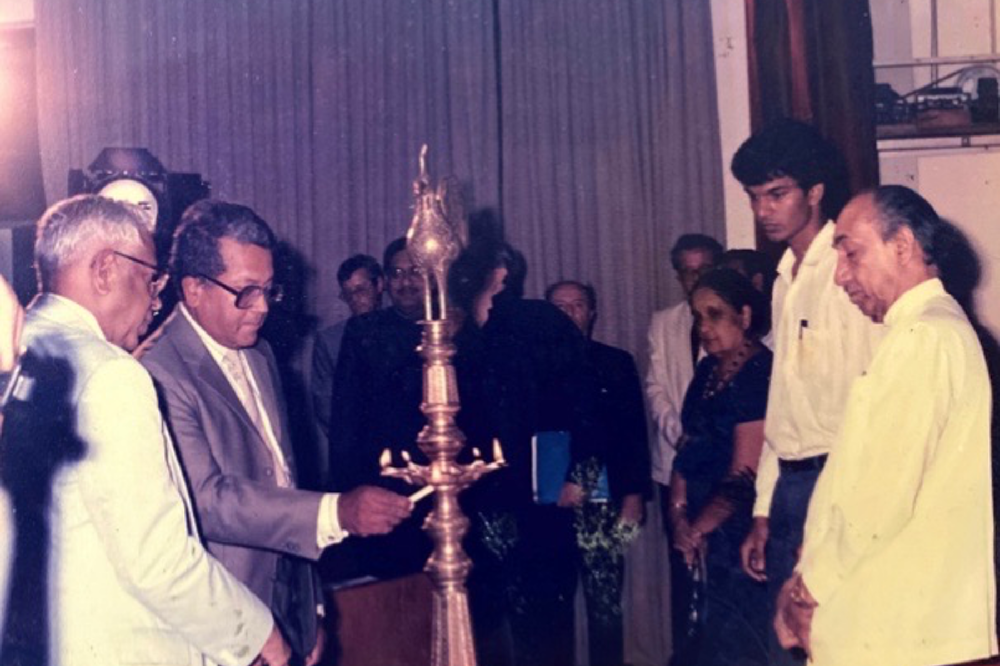

> [events](../)

> Professor Cyril Ponnamperuma and Professor Kapila Dahanayake of the IFS on the left.  
> Sirima Bandaranayake, Ruchira Bomiriya and President J.R. Jayewaredene on the right.  
> Anura Bandaranayake and Professor Ralph Buultjens in the bacground.

## Bicentennial of the French Revolution (1789&nbsp;-&nbsp;1989)
