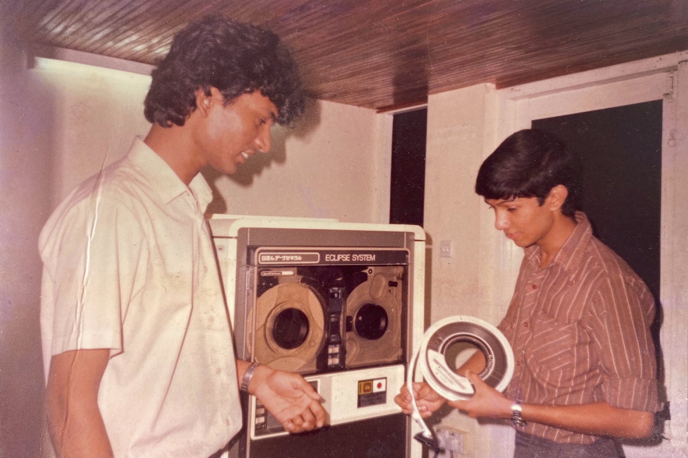

> [events](../)

> The Data General MV-7800 Eclipse running AOS/VS (Advanced Operating System / Virtual Storage) donated by Japan.  
> Ruchira Bomiriya and Kanishka Perera (system operators).

## MV-7800 Mini Computer (1989)
